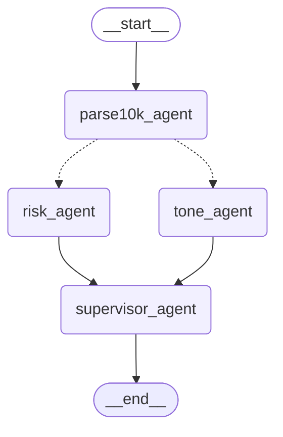

```mermaid
graph TD;
	__start__([<p>__start__</p>]):::first
	parse10k_agent(parse10k_agent)
	risk_agent(risk_agent)
	tone_agent(tone_agent)
	supervisor_agent(supervisor_agent)
	__end__([<p>__end__</p>]):::last
	__start__ --> parse10k_agent;
	parse10k_agent -.-> risk_agent;
	parse10k_agent -.-> tone_agent;
	risk_agent --> supervisor_agent;
	tone_agent --> supervisor_agent;
	supervisor_agent --> __end__;
	classDef default fill:#f2f0ff,line-height:1.2
	classDef first fill-opacity:0
	classDef last fill:#bfb6f
```